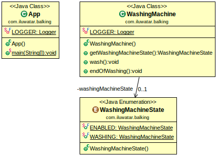

# 设计模式
##  设计原则

- 开闭原则(Open-closed Principle,OCP)
- 依赖导致原则(Dependency Inversion Principle,DIP)
- 单一职责原则(Simple Responsibility Principle,SRP)
- 接口隔离原则(Interface Segregation Principle,ISP)
- 迪米特法则(Law of Demeter,LoD)
- 里氏替换原则(Liskov Substitution Principle,LSP)
- 合成复用原则(Composite/Aggregate Reuse Principle,CARP)

## 观察者模式
##  门面模式
## 迭代器模式
##  Data Bus
###  Intent

 Allows send of messages/events between components of an application without them needing to know about each other. They only need to know about the type of the message/event being sent.    
 
### Applicability

Use Data Bus pattern when

* you want your components to decide themselves which messages/events they want to receive
* you want to have many-to-many communication
* you want your components to know nothing about each other
    
## retry

## Event Driven Architecture

## balking

## commander

